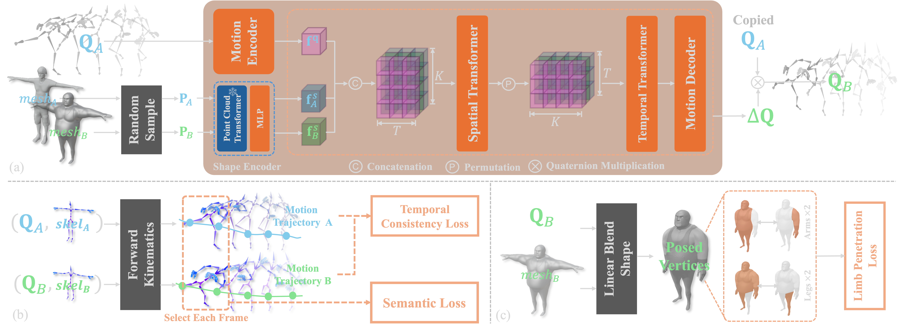

# \[WIP\] STaR: Seamless Spatial-Temporal Aware Motion Retargeting with Penetration and Consistency Constraints

This is the code for the ICCV 2025 paper ["STaR: Seamless Spatial-Temporal Aware Motion Retargeting with Penetration and Consistency Constraints"](https://arxiv.org/abs/2504.06504), by Xiaohang Yang, et al.

Neural motion retargeting model, STaR, is designed for a balance between: (1) motion semantics preservation, (2) physical plausibility, and (3) temporal consistency.

 > 🚀 **Update:** The full code will be released soon—stay tuned! 👀

- [x] test code, with network weight and a processed test set;
- [ ] inference code, with a PyTorch3D-based rendering function;
- [ ] data preparation, and train code;



## Environment Setup

### 1. Creete Conda environment
We tested with Python 3.9, CUDA 11.8.
```
conda create python=3.9 -n star
conda activate star
```

### 2. Install main dependencies

* **Install [PyTorch](https://pytorch.org/get-started/previous-versions/). We have tested on PyTorch 2.3.1, ...**

```
conda install pytorch==2.3.1 torchvision==0.18.1 torchaudio==2.3.1 pytorch-cuda=11.8 -c pytorch -c nvidia
```

* **Install [PyTorch3D](https://github.com/facebookresearch/pytorch3d) (for visualisation only).**

  Build from source code or refer to [this link](https://github.com/facebookresearch/pytorch3d/discussions/1752) for pre-built wheels that matches your environments.

### 3. Install other packages

```
pip install numpy==1.23.3 tqdm wandb scipy matplotlib==3.4.2 ninja
cd ./submodules
pip install ./pointnet2_ops_lib/.
```

## Test

Download the processed test set from [here](). Put all content under ```./datasets/mixamo/```

```
python test.py --config ./config/test_config.yaml
```

## Data Preparation (TODO)

(We use scripts to download, match motion instances and create datesets. This part is a little bit complicated, we will release this part as soon as possible, together with a processed version.)

## Inference (TODO)

```
python inference.py --config ./config/config.yaml
```

## Train (TODO)

```
python train.py --config ./config/config.yaml
```

## Citation
If you find this work helpful, please consider citing it as follows:
```   
@misc{yang2025starseamlessspatialtemporalaware,
      title={STaR: Seamless Spatial-Temporal Aware Motion Retargeting with Penetration and Consistency Constraints}, 
      author={Xiaohang Yang and Qing Wang and Jiahao Yang and Gregory Slabaugh and Shanxin Yuan},
      year={2025},
      eprint={2504.06504},
      archivePrefix={arXiv},
      primaryClass={cs.CV},
      url={https://arxiv.org/abs/2504.06504}, 
}
```
